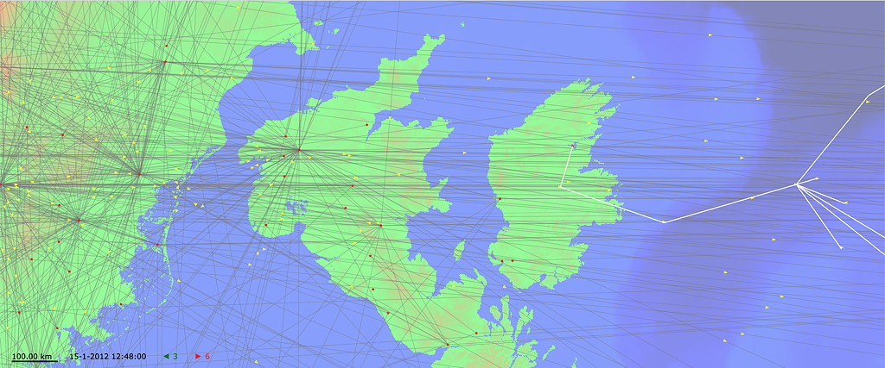

# BeamRelay

BeamRelay is an air traffic simulation with the aim of determining reachability of airborne airplanes via high-speed, relayed optical data communication.

## Additional resources

- An [animated version of above map](https://content.mpsitech.cloud/conmap/mapLH400/conmap.xml), representing a flight from Frankfurt (FRA) to New York (JFK)
- The [proceedings article](https://content.mpsitech.cloud/Global_coverage_free_space.pdf) of BeamRelay's ICNS 2014 presentation

## Contact

The BeamRelay project serves as one of the reference projects for WhizniumSBE, an innovative Open Source software development tool provided by Munich-based start-up [MPSI Technologies GmbH](https://www.mpsitech.com). Feel free to [contact us](mailto:contact@mpsitech.com) with any questions.
